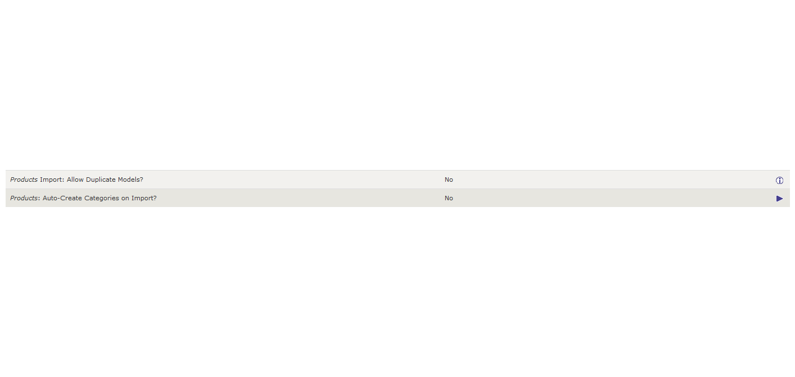

# ProductsHandler &mdash; Usage Notes

The `ProductsHandler` supports the import and export of product-related fields for your Zen Cart.

| Feature Name                             | Comments                                                     |
| ---------------------------------------- | ------------------------------------------------------------ |
| Export/Import                            | Both                                                         |
| Customized Fields for Export             | &check;                                                      |
| Export Filters                           | Product's Status, Product's Manufacturer, Product's Category |
| Required Columns (aka Fields) for Import | `v_products_id`, `v_products_model`                          |
| DbIo Commands                            | `REMOVE`, `ADD`                                              |

## Special Fields

This handler supports some additional "special" fields:

| Field Name           | Description                                                  |
| -------------------- | ------------------------------------------------------------ |
| v_manufacturers_name | The 'name' associated with the product's `manufacturers_id`. |
| v_tax_class_title    | The 'name' associated with the product's `products_tax_class_id`. |
| v_categories_name    | The name(s) associated with the product's `master_categories_id`, using the store's _default language_.  This is represented by `^`-separated names reflecting the product's category path. |
| v_dbio_command       | Can be either an empty string (no command), `ADD` to force the addition/insertion of a product's definition or `REMOVE` to cause the product to be removed from the database. |

## Configuration Settings

This handler uses a couple of Database I/O Manager configuration settings that control import features:

### Allow Duplicate Models?

This setting, which defaults to **No** on installation, indicates whether (**Yes**) or not to allow duplicate model numbers to be applied to products on an import.  If set to **No**, a csv-line import that would result in a duplicate model-number to be applied is not imported.

### Auto-create Categories on Import?

This setting, which defaults to **No** on installation, indicates whether (**Yes**) or not to automatically create otherwise non-existent categories when importing a product.  If set to **No**, a csv-line import that contains an undefined `v_categories_name` and would result in a product's addition/insert is not imported.

## Export Features

The default, non-customized export for this handler gathers all the fields from the `products`, `products_description` and `meta_tags_products_description` tables, along with this handler's [special fields](#special-fields).

Notes:

1. If you are exporting _all_ fields for a multi-lingual store, the fields from the `products_description` and `meta_tags_products_description` *tables* will each be grouped by language (default language first).
2. If you are exporting customized fields for a multi-lingual store, any *fields* within those two language-dependent table are grouped by language (default language first).